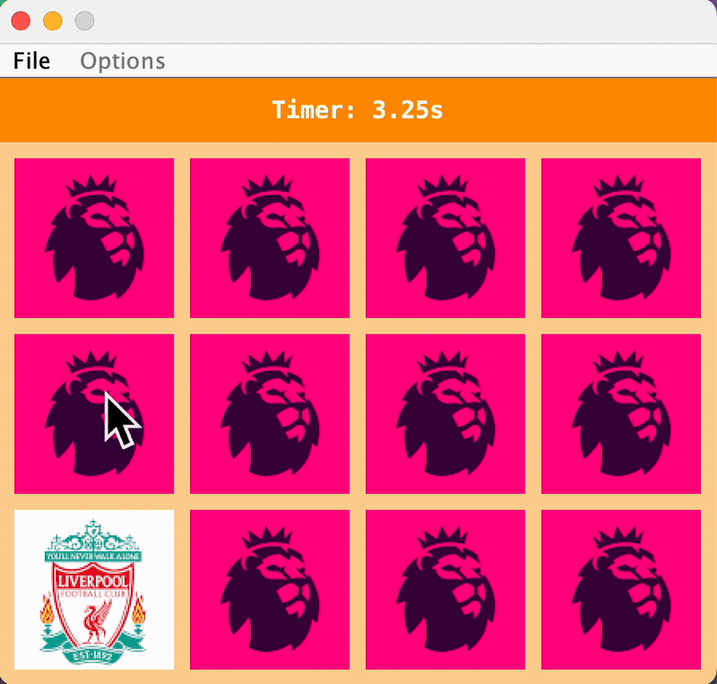

# Card Quest

## Overview

Card Quest is an engaging Java-based application designed to challenge and enhance memory skills. This interactive game offers various themes, customizable board sizes, and different configurations for an immersive user experience.



## Features

* **Multiple Themes**: Choose from a variety of themes, including animals and English football clubs.
* **Customizable Board Size**: Tailor the game board size to your preference.
* **Dynamic Game Configuration**: Adjust the number of cards and their arrangement.
* **User-Friendly Interface**: Built with Java Swing for a smooth graphical experience.

## Getting Started

### Prerequisites

* Java Development Kit (JDK) 17 or higher
* Gradle (or use the included Gradle wrapper)

### Installation

1. Clone the repository:
```bash
git clone https://github.com/joshuabvarghese/card-quest.git
cd card-quest
```

2. Build the project:
```bash
./gradlew build
```

3. Run the application:
```bash
./gradlew run
```

## Project Structure
```
card-quest/
│
├── src/
│   ├── main/
│   │   ├── java/     # Main application code
│   │   └── resources/ # Images and configuration files
│   │
│   └── test/
│       └── java/     # Unit tests
│
├── build.gradle      # Gradle build script
└── README.md        # This file
```

## Usage

1. Launch the application
2. Select your preferred theme
3. Choose the game board size
4. Start a new game or reset an ongoing one